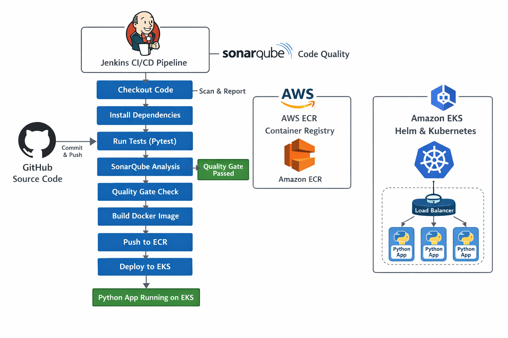

# Python DevOps CI/CD Pipeline

This project demonstrates a complete CI/CD pipeline for a Python Flask application using **Jenkins**, **SonarQube**, **Docker**, **Amazon ECR**, **Amazon EKS**, and **Helm**.

The pipeline automates code testing, code quality analysis, container image creation, pushing images to AWS ECR, and deploying the application to Kubernetes on Amazon EKS.



---

## Project Overview

The application is a Python Flask web app stored in GitHub.  
Whenever code is pushed to the repository, Jenkins is triggered automatically through a GitHub webhook.

The pipeline performs the following steps:

1. Checks out the source code from GitHub
2. Installs Python dependencies
3. Runs automated tests using Pytest
4. Performs static code analysis with SonarQube
5. Waits for the SonarQube Quality Gate result
6. Builds a Docker image for the application
7. Pushes the Docker image to Amazon ECR
8. Deploys the application to Amazon EKS using Helm
9. Exposes the application using a Kubernetes LoadBalancer service

---

## Technologies Used

- **Python / Flask** – Web application
- **Pytest** – Automated testing
- **Jenkins** – CI/CD pipeline
- **SonarQube** – Code quality analysis
- **Docker** – Containerization
- **Amazon ECR** – Docker image registry
- **Amazon EKS** – Kubernetes cluster
- **Helm** – Kubernetes package manager
- **GitHub** – Source code management
- **AWS** – Cloud infrastructure

---

## Project Structure

```text
jenkins-ci-cd-pipeline-python/
├── helm/
│   └── python-app/
│       ├── Chart.yaml
│       ├── values.yaml
│       └── templates/
│           ├── deployment.yaml
│           └── service.yaml
└── python-app/
    ├── app/
    │   ├── static/
    │   ├── templates/
    │   ├── __init__.py
    │   └── routes.py
    ├── tests/
    │   └── test_routes.py
    ├── Dockerfile
    ├── Jenkinsfile
    ├── requirements.txt
    ├── run.py
    └── sonar-project.properties


-Author

  Ahmad Alabrash

-Conclusion

  This project demonstrates a full DevOps workflow for a Python application, from code commit to Kubernetes deployment, using modern CI/CD and cloud-native tools.
